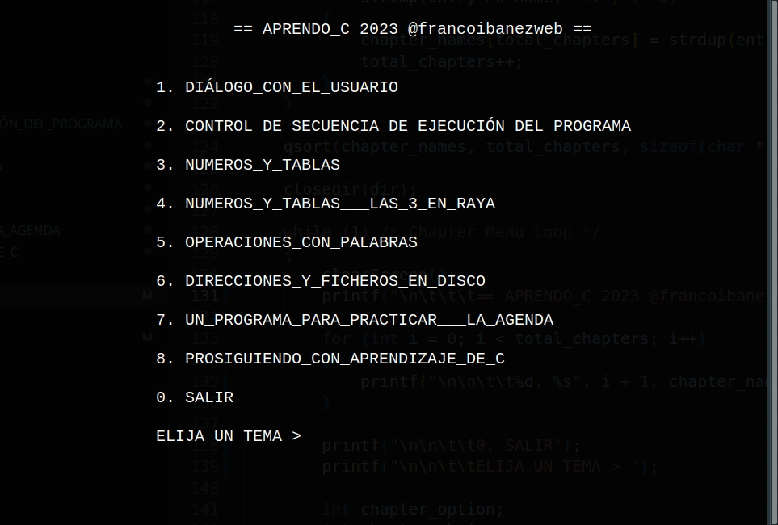

# aprendoC
Se trata de un programa de consola que permite recorrer de forma interactiva
varios programas escritos en C, tratando distintos temas de programación.

## Requisitos del Sistema

Asegúrate de tener las siguientes herramientas instaladas en tu sistema Linux
antes de compilar este proyecto:

- CMake (versión 3.27.1 o superior)
- GNU Make (versión 4.3 o superior)
- Build-Essential (para compilar paquetes en Debian/Ubuntu)
    - Puedes instalarlo con: `sudo apt-get install build-essential`

## Instrucciones de Compilación

Sigue estos pasos para compilar el proyecto:

1. Clona este repositorio: `git clone <URL_del_repositorio>`
2. Crea una carpeta llamada "build" dentro del repositorio: `mkdir build`
3. Dirígete a la carpeta de compilación: `cd build`
4. Configura el proyecto con CMake: `cmake ..`
5. Compila el código con GNU Make: `make`
6. Ejecuta el programa resultante: `./aprendoC`

¡Listo! Ahora deberías tener el programa funcionando en tu sistema.

Si tienes algún problema o pregunta, no dudes en contactarme.
